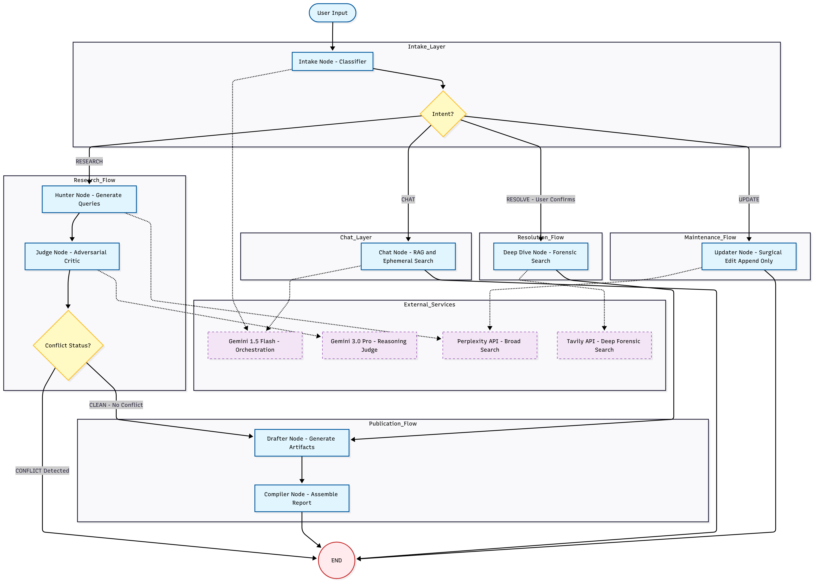

# Company Research Assistant - AI Agent

**Eightfold.ai Assignment Submission**  
An intelligent conversational AI agent that helps users research companies and generate account plans through natural dialogue.

---

## 🎯 Project Overview

This AI agent demonstrates advanced agentic behavior by:
- **Gathering information** from multiple sources (Perplexity AI, Tavily, Google Gemini)
- **Providing real-time updates** during research with conflict detection
- **Allowing selective updates** to specific sections of generated reports
- **Maintaining natural conversations** while staying focused on company research

---

## 🏗️ Architecture

### System Design



### Agent Workflow (LangGraph State Machine)

1. **Intake Node**: Classifies user intent (RESEARCH, UPDATE, CHAT, RESOLVE)
2. **Hunter Node**: Executes 8 parallel searches across multiple sources
3. **Judge Node**: Detects conflicts in gathered data using Gemini 3.0 Pro
4. **Deep Dive Node**: Resolves conflicts with targeted Tavily searches
5. **Drafter Node**: Generates structured briefing sections
6. **Compiler Node**: Synthesizes final report with citations
7. **Updater Node**: Appends new sections without overwriting existing content
8. **Chat Node**: Handles conversational queries with RAG + external search

---

## 🚀 Setup Instructions

### Prerequisites

- **Python 3.11** (Required)
- **Node.js 18+** and npm
- API Keys:
  - Google Gemini API
  - Perplexity API
  - Tavily API

### Backend Setup

1. **Clone the repository**
   ```bash
   git clone https://github.com/vishal27shetty/Company-Research-Agent.git
   cd Company-Research-Agent
   ```

2. **Create Python virtual environment**
   ```bash
   python3.11 -m venv venv
   source venv/bin/activate  # On Windows: venv\Scripts\activate
   ```

3. **Install dependencies**
   ```bash
   pip install -r requirements.txt
   ```

4. **Configure environment variables**
   Create a `.env` file in the root directory:
   ```env
   GOOGLE_API_KEY=your_gemini_api_key
PERPLEXITY_API_KEY=your_perplexity_api_key
TAVILY_API_KEY=your_tavily_api_key
# Optional: LangSmith Observability
LANGCHAIN_API_KEY=your_langchain_api_key
LANGCHAIN_PROJECT="Company Research Agent"
   ```

5. **Start the backend server**
   ```bash
   uvicorn main:app --reload --port 8000
   ```
   Backend will be available at `http://localhost:8000`

### Frontend Setup

1. **Navigate to frontend directory**
   ```bash
   cd frontend
   ```

2. **Install dependencies**
   ```bash
   npm install
   ```

3. **Start the development server**
   ```bash
   npm run dev
   ```
   Frontend will be available at `http://localhost:3000`

---

## 🎨 Design Decisions

### 1. **LangGraph for Agentic Workflow**
**Why**: LangGraph provides a state machine framework perfect for complex multi-step agent workflows.
- **Benefit**: Clear separation of concerns, easy debugging, and natural handling of conditional routing
- **Alternative Considered**: Custom orchestration logic (rejected due to complexity)

### 2. **Multi-Source Research Strategy**
**Why**: Single sources can be biased or incomplete.
- **Implementation**: 8 parallel Perplexity searches + Tavily for verification
- **Benefit**: Comprehensive, cross-validated information

### 3. **Conflict Detection with Gemini**
**Why**: Automated quality control prevents hallucinations and contradictions.
- **Implementation**: Judge node analyzes all gathered data for inconsistencies
- **Benefit**: User is alerted to conflicts and can request deep dives

### 4. **Append-Only Updates**
**Why**: Preserves research history and prevents data loss.
- **Implementation**: New sections are appended, not merged
- **Benefit**: Users can see the evolution of their research

### 5. **Server-Sent Events (SSE)**
**Why**: Real-time streaming of research progress.
- **Implementation**: Backend streams status updates, citations, and reports
- **Benefit**: User sees agent "thinking" and working

### 6. **Strict Topic Guardrails**
**Why**: Prevents off-topic hallucinations and maintains focus.
- **Implementation**: Chat node refuses non-business topics
- **Benefit**: Professional, reliable behavior

---

## 🧠 Intelligence & Adaptability

### Conversational Quality & User Personas

The agent adjusts behavior depending on user interaction style:

#### 1. The Confused User
- **Detection**: Ambiguous or missing company references  
- **Behavior**: Politely asks for clarification before searching  

#### 2. The Efficient User
- **Detection**: Direct and specific information requests  
- **Behavior**: Provides concise answers without full reports  

#### 3. The Chatty User
- **Detection**: Off-topic or casual conversational patterns  
- **Behavior**: Acknowledges while guiding back to research context  

#### 4. The Edge Case User
- **Detection**: Invalid, malicious, or persona-breaking inputs  
- **Behavior**: Maintains professional boundaries and redirects  

---

### Intent Classification (Priority Order)

1. **CLARIFY**
   - Highest priority  
   - Triggered when intent is unclear  
   - Avoids unnecessary external API calls  

2. **CHAT**
   - Focuses on follow-ups using existing report knowledge  
   - External lookup only when needed  

3. **RESEARCH**
   - Triggered when company name is explicit  
   - Supports both full research reports and targeted insights  

4. **UPDATE**
   - Adds new sections without overwriting existing content  
   - Maintains continuity of research history  

5. **RESOLVE**
   - Handles conflicts in data  
   - Uses authoritative sources to verify and finalize information  

---

## 📊 Key Features

✅ **Multi-source research** with parallel API calls  
✅ **Conflict detection** and resolution workflow  
✅ **Selective section updates** without overwriting  
✅ **Real-time progress updates** via SSE  
✅ **Automatic citations** in References section  
✅ **Topic guardrails** to prevent hallucinations  
✅ **Natural conversation** with context awareness  

---

## 📁 Project Structure

```
Company-Research-Agent/
├── backend/
│   ├── graph.py          # LangGraph workflow definition
│   ├── nodes.py          # Agent node implementations
│   ├── prompts.py        # LLM prompts
│   ├── schema.py         # State schema
│   └── tools.py          # API integrations
├── frontend/
│   ├── components/
│   │   ├── ChatInterface.tsx    # Main chat UI
│   │   └── ReportCanvas.tsx     # Report viewer
│   └── app/
│       └── page.tsx             # Entry point
├── main.py               # FastAPI server
├── requirements.txt      # Python dependencies
└── README.md            # This file
```

---

## 🔧 Technologies Used

**Backend**:
- FastAPI (async web framework)
- LangGraph (agent orchestration)
- LangChain (LLM integrations)
- Google Gemini 2.0 Flash (reasoning) & Gemini 3.0 Pro (Judge)
- Perplexity AI (search)
- Tavily (verification)

**Frontend**:
- Next.js 16 (React framework)
- TypeScript (type safety)
- Tailwind CSS (styling)
- Shadcn UI (components)
- Framer Motion (animations)

---

## 🐛 Known Limitations

1. **API Rate Limits**: Heavy usage may hit API quotas
2. **Search Quality**: Depends on external API data quality
3. **Latency**: Multiple API calls can take 10-30 seconds for full research

---

## 📝 License

This project is submitted as part of the Eightfold.ai AI Agent Building Assignment.

---

## 👤 Author

**Vishal Shetty**  
GitHub: [@vishal27shetty](https://github.com/vishal27shetty)

---

## 🙏 Acknowledgments

- Eightfold.ai for the assignment opportunity
- LangChain team for the excellent framework
- Perplexity, Tavily, and Google for API access
